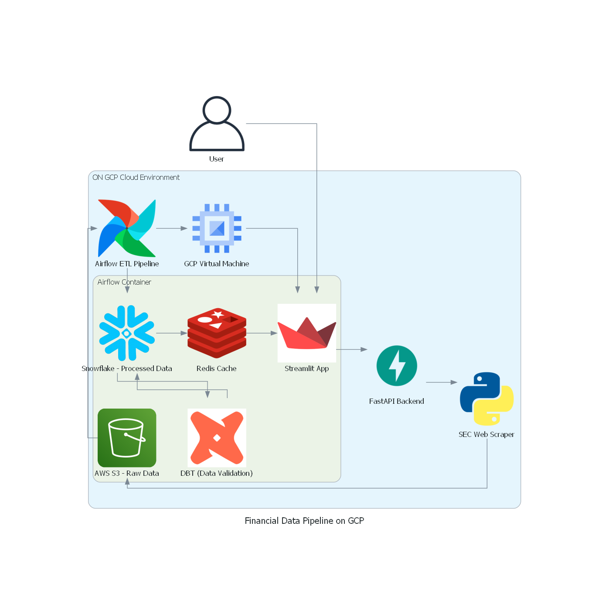

# SEC Financial Data Pipeline using Snowflake & DBT

This repository contains the end-to-end solution for building a master financial statement database for US public companies. The project supports fundamental analysis by using SEC financial statement data sets and encompasses several components including data scraping, storage design, validation, Airflow pipelines for ETL processes, and deployed applications for data access via Streamlit and FastAPI.

## Workflow Diagram

Below is the workflow diagram for the AI Application:

### Diagram Description:
1. **User**: The end-user interacts with the application via the Streamlit frontend.
2. **Streamlit App**: The frontend built using Streamlit.
3. **FastAPI Backend**: The backend server that handles data processing.
4. **Data Extraction**:
   - **Python**: For extracting multiple zips from SEC website.
5. **AWS S3 Bucket**: Used for storing raw unprocessed data.
6. **Snowflake**: Used for storing json and rdbms data.
7. **Google Cloud Run**: Used for Deploying FastAPI applications
8. **Streamlit In-builtDeployment**: Used for Deploying Streamlit application for UI/UX. 

## Prerequisites

- Python 3.7+
- [Diagrams](https://diagrams.mingrammer.com/) library for generating the workflow diagram.
- AWS account with S3 bucket access.
- Streamlit and FastAPI installed for frontend and backend development.
- Install [Google Cloud SDK](https://cloud.google.com/sdk/docs/install)
- Install [Docker](https://docs.docker.com/get-docker/) 

